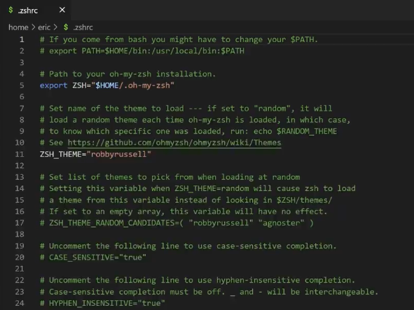

# Machine Learning aplicado a temas ambientales 
## Universidad Nacional de Colombia


__Instructor :__ Carlos Daniel Jiménez Martinez

* [Email](danieljimenez88m@gmail.com)
*  [Linkedin](https://www.linkedin.com/in/djimenezm/)
* [Github](https://github.com/carlosjimenez88M)


## Objetivo General

El uso de modelos estadísticos en algoritmos computacionales permite a las computadoras tomar decisiones y hacer predicciones, y realizar tareas que tradicionalmente requieren habilidades cognitivas humanas. 
El aprendizaje automático es el campo interdisciplinario en la intersección de la estadística y la informática que desarrolla dichos algoritmos y los integra con sistemas informáticos. Este campo sustenta muchas tecnologías y técnicas modernas, como el reconocimiento de voz, la generación de textos, la búsqueda en internet, la bioinformática que puede ser la que más nos interese profundizar, la visión por computadora, el edge computing,entre otros, todos basados en Machine Learning y su aplicaciones en AI.

Este curso sobre Aprendizaje Automático Aplicado a Problemas Ambientales explicará cómo construir sistemas que aprendan y se adapten utilizando aplicaciones del mundo real. Algunos de los temas que se cubrirán incluyen análisis de series temporales, aprendizaje automático, análisis de datos con Python, modelos de Computer vision y modelos recurrentes. El curso estará orientado a proyectos, con énfasis en la implementación de software de algoritmos de aprendizaje aplicados a problemas reales, en particular, modelado de la calidad del aire, detección de deforestación, análisis de datos climáticos, entre otros.

En este curso, los estudiantes aprenderán a:

1. Desarrollar y aplicar modelos de series temporales para predecir fenómenos ambientales como la contaminación del aire y el cambio climático.
2. Utilizar técnicas de aprendizaje automático para analizar datos ambientales y generar predicciones útiles para la toma de decisiones.
3. Implementar modelos de procesamiento de lenguaje natural para analizar grandes volúmenes de textos científicos y noticias relacionadas con el medio ambiente.
4. Desarrollar algoritmos de aprendizaje automático que puedan detectar patrones en datos ambientales y proporcionar alertas tempranas sobre posibles desastres naturales.
5. Aplicar modelos recurrentes para el análisis y predicción de datos secuenciales en estudios ambientales.

Este curso está diseñado para ser altamente práctico, permitiendo a los estudiantes trabajar en proyectos que aborden problemas ambientales del mundo real. Los estudiantes escribirán e implementarán algoritmos de aprendizaje en Python, utilizando bibliotecas y herramientas modernas para resolver desafíos críticos relacionados con el medio ambiente. Al final del curso, los participantes tendrán la capacidad de construir y desplegar soluciones de aprendizaje automático que pueden tener un impacto significativo en la preservación y mejora de nuestro entorno natural.

## Objetivo Especifico


1. **Desarrollar y aplicar modelos de series temporales para predecir fenómenos ambientales**:
   - **Alcance**: Introducir a los estudiantes en los conceptos básicos de series temporales.
   - **Actividades**: Enseñar cómo recolectar y preparar datos ambientales históricos (e.g., niveles de contaminación, temperatura).
   - **Resultado esperado**: Los estudiantes podrán crear y evaluar modelos simples de series temporales para predecir futuros niveles de contaminación del aire o cambios climáticos.

2. **Utilizar técnicas de aprendizaje automático para analizar datos ambientales**:
   - **Alcance**: Proveer una comprensión básica de los algoritmos de aprendizaje automático.
   - **Actividades**: Implementar algoritmos de regresión y clasificación para identificar patrones en datos ambientales.
   - **Resultado esperado**: Los estudiantes podrán aplicar modelos de aprendizaje automático para analizar datos ambientales y realizar predicciones sencillas.


3. **Desarrollar algoritmos de aprendizaje automático para detectar patrones en datos ambientales**:
   - **Alcance**: Enseñar técnicas básicas para el análisis de datos y detección de patrones.
   - **Actividades**: Implementar algoritmos para detectar anomalías y patrones en conjuntos de datos ambientales.
   - **Resultado esperado**: Los estudiantes podrán identificar y visualizar patrones en datos ambientales, proporcionando alertas tempranas sobre posibles desastres naturales.

4.  **Aplicar modelos recurrentes para el análisis y predicción de datos secuenciales en estudios ambientales**:
   - **Alcance**: Introducción a los modelos recurrentes y su aplicación en datos secuenciales.
   - **Actividades**: Implementar modelos recurrentes simples para analizar y predecir datos como series temporales de temperatura y precipitación.
   - **Resultado esperado**: Los estudiantes podrán utilizar modelos recurrentes para predecir tendencias en datos secuenciales y evaluar su precisión.


##  Requerimientos 

Para este curso es necesario instalar los siguientes programas:

* [Python](https://www.python.org/downloads/) version 3.10
* [Scikit-learn](https://scikit-learn.org/stable/)
* [Tensorflow](https://www.tensorflow.org/?hl=es-419)
* [Numpy](https://numpy.org/)
* [Scipy](https://scipy.org/)
* [Pandas](https://pandas.pydata.org/)
* [Seaborn](https://seaborn.pydata.org/)
* [Conda](https://www.anaconda.com/download)


Para el editor de código usaremos Visual Studio Code

*  En el siguiente https://code.visualstudio.com/download descargue VScode según su sistema operativo
* Después vaya a extensiones e instale Python


* Después de ello vaya a la terminal y coloque el siguiente código

```bash
sh -c "$(curl -fsSL https://raw.githubusercontent.com/ohmyzsh/ohmyzsh/master/tools/install.sh)"
```

* Después coloque lo siguiente 

```bash
~ cd ~/.zshrc
```

Deberá aparecerle una pantalla con la siguiente estructura



En la linea 11, donde aparece ZSH_THEMES, cambiela por uno de los que aparece en el siguiente link : https://github.com/ohmyzsh/ohmyzsh/wiki/Themes


## Contenido

| Sesión |                                                                Tema |                                                                            Presentación | Código                       |
|-------:|--------------------------------------------------------------------:|----------------------------------------------------------------------------------------:|------------------------------|
|      1 |                            Ciencia basadoa en teoría vs en en datos |                                                       [Introducción](Clase1/clase1.pdf) |                              |
|      2 | Principios del Machine Learning y aplicaciones en temas ambientales |                                                                                         |                              |
|      3 |                                           Preprocesamiento de datos |                                                                                         |                              |
|      4 |                     Tipos de conjuntos , objetos y transformaciones |                                                                                         |                              |
|      5 |                                      Análisis Exploratorio de datos |                                                                                         |                              |
|      6 |                                    Introducción al mahcine Learning | [Clase #1](Clase6/Clase ML_Classification.pdf)[Clase #2](Clase6/entrenando_modelos.pdf) | [Notebook1](https://colab.research.google.com/drive/1ciRl8LERSrw_ANliRKvGB617M-u4tItG), [Notebook2](https://colab.research.google.com/drive/1SiTN959JUzbrejxGlJX9nicAyGMHx5b7?usp=sharing) |
|      7 |                                                               CARET |                                                                                         |                              |
|      8 |                       Machine Learning aplicado a temas ambientales |                                                                                         |                              |
|      9 |                                                    Series de tiempo |                                                                                         |                              |


## Notas de clases

En el siguiente link encontrará las notas de clase que el instructor usará para cada una de las sesiones de las clases
sientase libre de usarlas [Link]()


## Referencias 

1. 